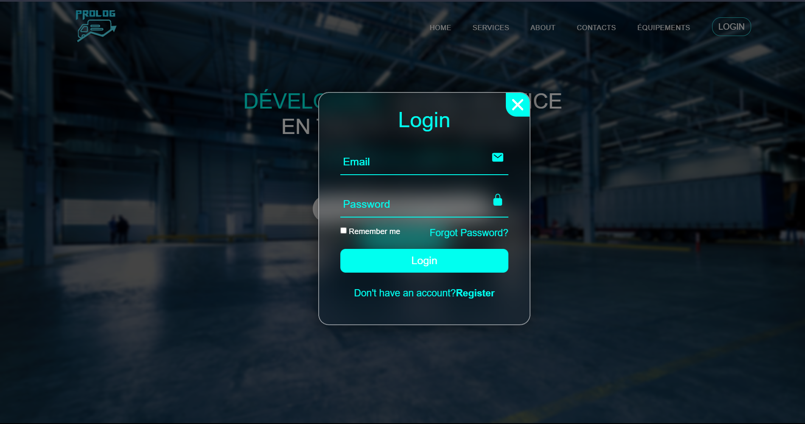
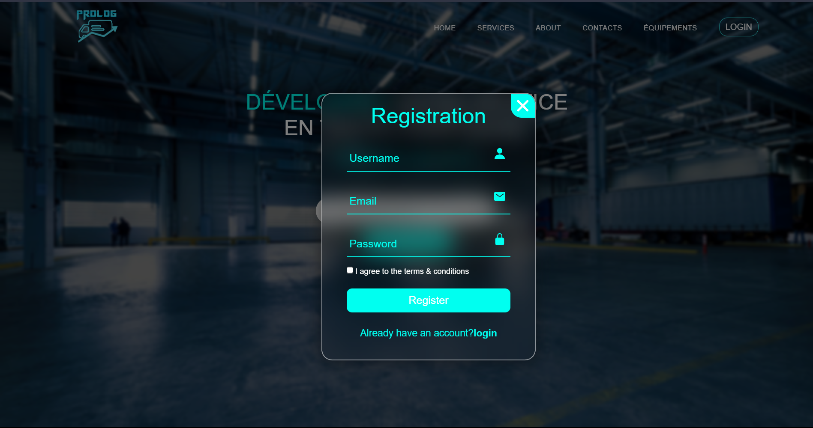

# ProLog
___
ProLog est une application de gestion d'entreprise de logistique permettant de 
gérer les opérations de logistique telles que la gestion des clients, 
des livraisons et des transporteurs. Elle a été développée dans 
le cadre de mon projet de fin d'études en utilisant Spring Boot pour le Backend 
et React pour le frontend.

Les deux parties du projets sont separées dans deux repositories differents voici leurs liens :

* [ProLog Frontend](https://github.com/abdellahfanidi/)

* [ProLog Backend](https://github.com/ouzlimnadir/prolog-backend)

## Fonctionnalités

- Gestion des clients : Ajouter, modifier, supprimer et afficher les clients, gérer leur statut 
et leur suivi.
- Gestion des colis : Ajouter, modifier, supprimer et afficher les livraisons, gérer leur 
statut, affecter un transporteur et suivre leur progression.
- Gestion des factures : Ajouter, modifier, supprimer et afficher les factures.
- Gestion des transporteurs : Ajouter, modifier, supprimer et afficher les transporteurs, 
gérer leurs informations et leurs disponibilités.

## Technologies utilisées

- **Backend** : Spring Boot, Java, Spring Web, Spring Data JPA, Spring Security, BCrypt, Java Web Token, Lombok
- **Frontend** : React, Axios ( Vous trouverez plus de details dans le repo Frontend)
- **Base de données** : MySQL
- **Outils de développement** : IntelliJ IDEA, Postman, Xampp, Git

## Prérequis

- Java JDK 17 ou supérieur
- Node.js et npm installés
- MySQL installé et configuré

## Installation

1. Cloner le repository depuis GitHub : `git clone https://github.com/ouzlimnadir/prolog-backend`
2. Importer le backend dans votre IDE préféré en tant que projet Maven.
3. Configurer la base de données MySQL en mettant à jour les informations d'accès dans le fichier `application.properties` du backend (Le schema s'initialise automatiquement).
4. Installer les dependances configurées dans le fichier `pom.xml`
5. Lancer l'application backend en exécutant la classe principale NomDeVotreApplication.java.
6. Cloner le repository pour le frontend et suivez les etapes cités dessus.
   1. Ouvrir le frontend dans le terminal et installer les dépendances en exécutant npm install.
   2. Lancer l'application frontend en exécutant npm start.
7. Ouvrir un navigateur web et accéder à l'URL http://localhost:3000 pour utiliser l'application.

## Captures d'écran
- **Home Page**

- **Login**

- **Registration**

## Contribuer

Si vous souhaitez contribuer à ce projet, vous pouvez ouvrir une nouvelle issue pour signaler un bug, proposer une amélioration ou soumettre une demande de fusion (pull request) avec vos modifications.

## Auteur

Ouzlim Nadir - [Contactez-moi](mailto:ouzlimnadir@gmail.com)